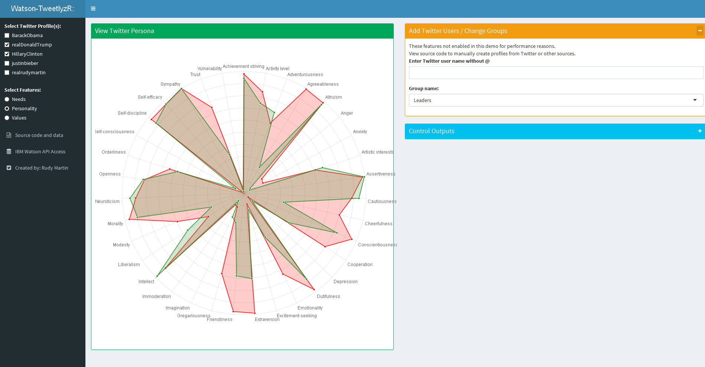

Watson-TweetlyzR 
========================================================
author: Rudy Martin - Developing  Data  Products
date: Sept2016
autosize: true

How to Gain Friends and Still Have Time for Yourself
========================================================

### Quality Relationships Require More Time, Skill

 1. Constant stream of online chatter 24/7 on Twitter
 2. Not all online personas are worth interacting with
 3. Some players are even dangerous
 4. Communicating online requires new speaking muscles

###  Solution: Our Social Matching Recipe

 1. Add One Part IBM Watson Personality Profile
 2. Add One Part Social Media Text - Extracted Tweets
 3. Mix-in with R Data Mining and Exploratory Analysis
 4. Serve Online via Interactive Shiny Visual Tool

Secret Ingredients: Dynamic Data and Radarchart
========================================================

```
chartJSRadar(scores[, c("Label", input$selectedPersonas)], 
    maxScale = maxScaleR(),
    scaleStepWidth = scaleStepWidthR(),
    scaleStartValue = input$scaleStartValue,
    responsive = input$responsive,
    labelSize = input$labelSize,
    addDots = input$addDots,
    lineAlpha = input$lineAlpha,
    polyAlpha = input$polyAlpha,
    showToolTipLabel=input$showToolTipLabel,
    colMatrix = v$cmText)
```

Watson-TweetlyzR : Fun Social Research
========================================================



Next Steps
========================================================
 1. Download Github code and sample data
 
    App:   https://rudymartin.shinyapps.io/Watson-TweetlyzR/
    
    Source code: https://github.com/RudyMartin/Watson-TweetlyzR
 
 2. Signup for IBM/Twitter developer accounts,insert credentials
 3. Insert your credentials and run in RStudio
 4. Have fun seeing what your friends are really saying
 5. Be a friend (Twitter:@realrudymartin  Email: <realrudymartin@gmail.com>)
